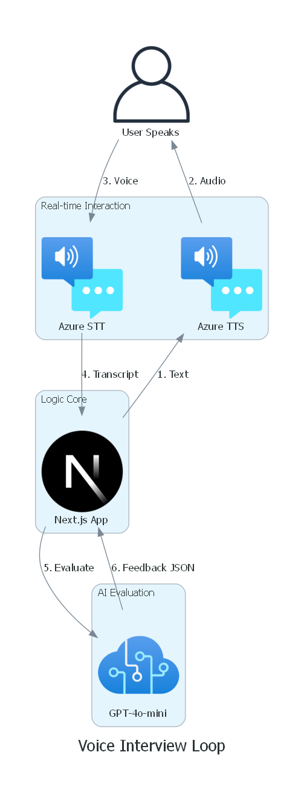
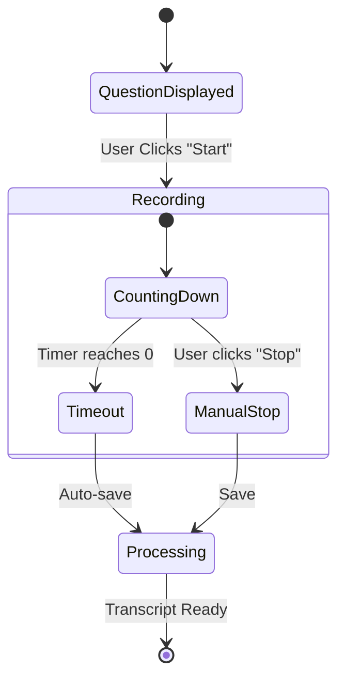
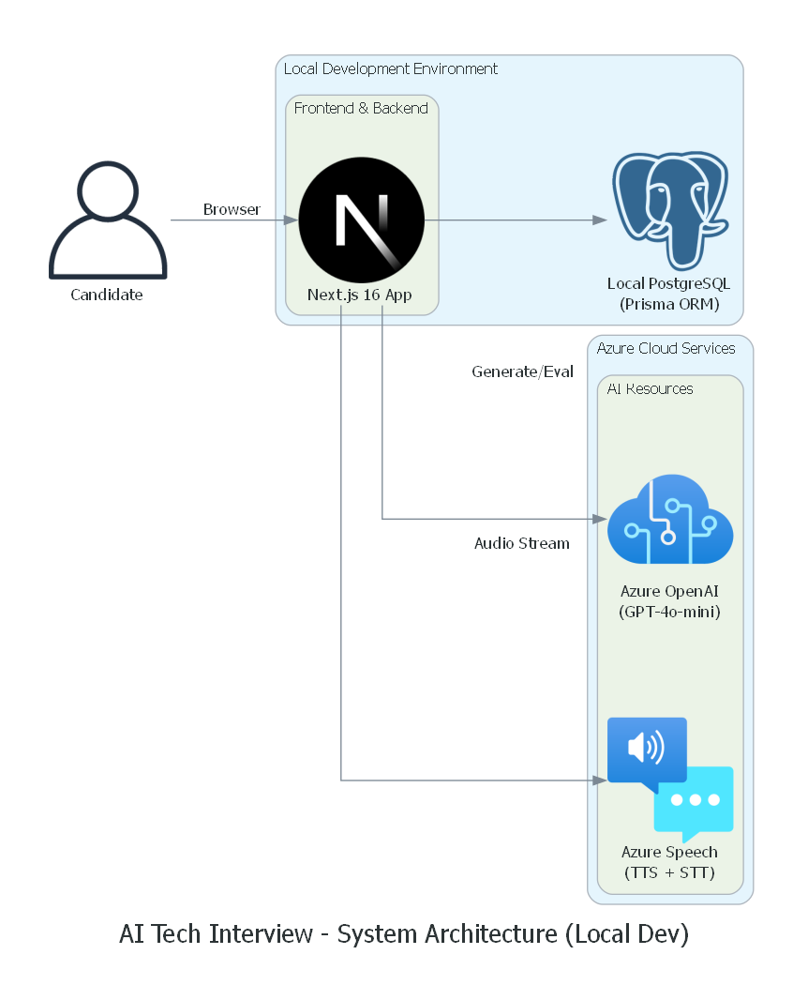
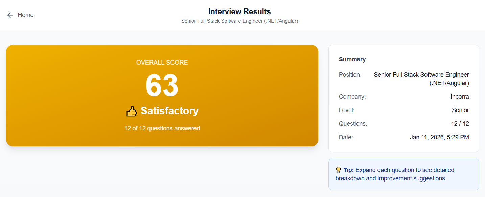

# 🎙️ AI Tech Interview - Voice-Powered Interview Preparation Platform

<div align="center">


**An AI-powered technical interview preparation platform that generates role-specific questions, conducts voice-based interviews, and provides detailed feedback with scoring.**

[Getting Started](#-getting-started) • [Features](#-key-features) • [Architecture](#️-architecture) • [Azure Setup](#-azure-services-setup) • [Contributing](#-contributing)

</div>

---

## 📋 Table of Contents

- [Overview](#-overview)
- [Key Features](#-key-features)
- [How It Works](#-how-it-works)
- [Technology Stack](#️-technology-stack)
- [Architecture](#️-architecture)
- [Getting Started](#-getting-started)
- [Azure Services Setup](#-azure-services-setup)
- [Project Structure](#-project-structure)
- [Seniority-Based Question Generation](#-seniority-based-question-generation)
- [Evaluation Metrics](#-evaluation-metrics)
- [API Reference](#-api-reference)
- [Cost Estimation](#-cost-estimation)
- [Documentation](#-documentation)
- [Roadmap](#️-roadmap)
- [Contributing](#-contributing)
- [License](#-license)

---

## 🎯 Overview

**AI Tech Interview** is a fullstack application designed to help software developers prepare for technical interviews through realistic, voice-based practice sessions. The platform leverages Azure AI services to:

1. **Generate tailored interview questions** based on your target role and job description
2. **Read questions aloud** using natural-sounding neural voices
3. **Record and transcribe your responses** in real-time
4. **Evaluate answers** and provide detailed feedback with actionable improvements

### Why This Matters

Traditional interview preparation often lacks the pressure and spontaneity of real interviews. This platform bridges that gap by:

- 🎤 **Voice-first interaction** - Practice speaking your answers, not just writing them
- 🎯 **Role-specific questions** - Questions tailored to your exact target position and seniority level
- 📊 **Objective feedback** - AI-powered evaluation with consistent scoring criteria
- ⚡ **Instant results** - No waiting for feedback; get insights immediately after each session

---

## ✨ Key Features

| Feature | Description |
|---------|-------------|
| 🎯 **Seniority-Aligned Questions** | Questions are generated matching your target seniority level (Junior, Semi-Senior, Senior) |
| 🎤 **Voice Interaction** | Text-to-Speech reads questions; Speech-to-Text captures your responses |
| ⏱️ **Timed Responses** | Each question has a time limit (1-10 min) based on category with visible countdown |
| 🤖 **AI-Powered Evaluation** | GPT-4o-mini analyzes responses against expected competencies |
| 📊 **Detailed Scoring** | Multi-dimensional scoring across 6 evaluation criteria |
| 💼 **Role Customization** | Supports any technical role with custom job descriptions |
| 📝 **Structured Feedback** | Strengths, improvements, and actionable suggestions |
| 🔄 **Session History** | Track progress across multiple practice sessions |

---

## 🔄 How It Works



*(The voice-driven interview loop)*

> 📸 **See more visuals:** Check [docs/README.md](docs/README.md) for architecture diagrams, screenshots, and detailed component descriptions.

### ⏱️ Response Timer Flow (MVP)



*(State diagram of the recording process)*

**Key Points:**
- ✅ User **must press a button** to start recording (gives time to think)
- ✅ **Visible countdown timer** shows remaining time (1-10 min based on category)
- ✅ Recording **auto-stops** when time runs out
- ✅ User can **manually stop** earlier if finished
- ✅ Whatever was spoken is **saved and transcribed**

---

## 🛠️ Technology Stack

| Layer | Technology | Version | Purpose |
|-------|------------|---------|---------|
| **Frontend** | Next.js (App Router) | 16.x | React framework with Server Components |
| **Runtime** | React | 19.x | UI library with concurrent features |
| **Language** | TypeScript | 5.x | Type-safe development |
| **Styling** | Tailwind CSS | 4.x | Utility-first CSS with `@theme inline` |
| **AI/LLM** | Azure OpenAI | GPT-4o-mini | Question generation & evaluation |
| **Text-to-Speech** | Azure Speech Service | Neural voices | Reading questions aloud |
| **Speech-to-Text** | Azure Speech Service | Real-time STT | Transcribing user responses |
| **Database** | PostgreSQL | - | Session and response storage |

### Why Next.js 16?

- **Turbopack by default** - No need for `--turbopack` flag
- **Server Actions** - Seamless server-side operations without explicit API routes
- **React 19** - Latest concurrent features and improved performance
- **App Router** - Modern file-based routing with layouts and nested routes
- **Streaming** - Real-time response streaming support
- **TypeScript First** - Excellent type safety and developer experience

---

## 🏗️ Architecture



*(The hybrid architecture: A local Next.js app connecting to Azure AI services)*

---

## 🚀 Getting Started

### Prerequisites

- **Node.js** 20.x or higher
- **pnpm**
- **Azure subscription** with:
  - Azure OpenAI Service access
  - Azure Speech Service resource
- **Modern browser** with microphone access (Chrome, Firefox, Edge recommended)

### Installation

1. **Clone the repository**

```bash
git clone https://github.com/cristofima/AI-Tech-Interview.git
cd AI-Tech-Interview
```

2. **Install dependencies**

```bash
pnpm install
```

3. **Configure environment variables**

Copy the example file and update with your Azure credentials:

```bash
cp .env.local.example .env.local
```

Then edit `.env.local` with your values:

```bash
# Azure OpenAI Configuration
AZURE_OPENAI_ENDPOINT=https://your-resource.openai.azure.com/
AZURE_OPENAI_API_KEY=your-api-key
AZURE_OPENAI_DEPLOYMENT=gpt-4o-mini
AZURE_OPENAI_API_VERSION=2024-10-21

# Azure Speech Service Configuration
AZURE_SPEECH_KEY=your-speech-key
AZURE_SPEECH_REGION=eastus
```

> 💡 **Terraform Users:** Run `terraform output -raw env_file_content > .env.local` in the `infra/` folder to auto-generate this file after provisioning.

4. **Run the development server**

```bash
pnpm dev
```

> **Note:** Next.js 16 uses Turbopack by default - no `--turbopack` flag needed!

5. **Open your browser**

Navigate to [http://localhost:3000](http://localhost:3000)

---

## 🔷 Azure Services Setup

### 1. Azure OpenAI Service

#### Create the Resource

1. Go to [Azure Portal](https://portal.azure.com)
2. Search for "Azure OpenAI" and click **Create**
3. Select your subscription and resource group
4. Choose a region (e.g., East US)
5. Provide a unique name for your resource
6. Select pricing tier (Standard S0)
7. Review and create

#### Deploy a Model

1. Navigate to your Azure OpenAI resource
2. Go to **Model deployments** → **Manage Deployments**
3. Click **Create new deployment**
4. Select model: `gpt-4o-mini`
5. Provide a deployment name (e.g., `gpt-4o-mini`)
6. Set tokens-per-minute rate limit as needed

#### Get Credentials

1. Go to **Keys and Endpoint** in your resource
2. Copy **KEY 1** or **KEY 2** → `AZURE_OPENAI_API_KEY`
3. Copy **Endpoint** → `AZURE_OPENAI_ENDPOINT`

### 2. Azure Speech Service

#### Create the Resource

1. Go to [Azure Portal](https://portal.azure.com)
2. Search for "Speech" and select **Speech Services**
3. Click **Create**
4. Select your subscription and resource group
5. Choose a region (e.g., East US)
6. Provide a unique name
7. Select pricing tier (Free F0 for development, Standard S0 for production)
8. Review and create

#### Get Credentials

1. Go to **Keys and Endpoint** in your Speech resource
2. Copy **KEY 1** → `AZURE_SPEECH_KEY`
3. Note the **Location/Region** → `AZURE_SPEECH_REGION`

### Supported Azure OpenAI Models

| Model | Version | Features |
|-------|---------|----------|
| `gpt-4o-mini` | 2024-07-18 | ✅ JSON Mode, ✅ Structured Outputs, Fast, Cost-effective |
| `gpt-4o` | 2024-08-06+ | ✅ JSON Mode, ✅ Structured Outputs, Higher capability |
| `gpt-4.1-mini` | 2025-04-14 | ✅ JSON Mode, ✅ Structured Outputs, Latest features |

---

## 📁 Project Structure

```
AI-Tech-Interview/
├── infra/                              # Terraform Infrastructure-as-Code
│   ├── main.tf                         # Azure resources (OpenAI, Speech)
│   ├── variables.tf                    # Input variables
│   ├── outputs.tf                      # Output values
│   ├── versions.tf                     # Terraform & provider versions
│   └── README.md                       # Infrastructure documentation
├── src/                                # Next.js source code
│   ├── app/                            # App Router (pages, layouts, API)
│   │   ├── api/                        # API Routes (sessions, responses, evaluate, speech)
│   │   ├── history/                    # Session history page
│   │   ├── interview/                  # Interview room page
│   │   ├── results/                    # Results dashboard page
│   │   ├── globals.css                 # Global styles + Tailwind theme
│   │   ├── layout.tsx                  # Root layout
│   │   └── page.tsx                    # Home page
│   ├── components/                     # React Components
│   │   ├── InterviewRoom.tsx           # Main interview logic
│   │   ├── OfflineStatusIndicator.tsx  # Network status UI
│   │   ├── PermissionsCheck.tsx        # Mic/Speech permissions
│   │   ├── ScoreCard.tsx               # Result visualization
│   │   └── SessionForm.tsx             # Setup form
│   ├── generated/                      # Generated code (Prisma)
│   ├── hooks/                          # Custom Hooks
│   │   ├── useAudioRecorder.ts         # Audio recording logic
│   │   ├── useOfflineSupport.ts        # Offline sync logic
│   │   ├── useSpeechRecognition.ts     # Azure STT
│   │   └── useSpeechSynthesis.ts       # Azure TTS
│   ├── lib/                            # Libraries & Utilities
│   │   ├── azure-openai.ts             # OpenAI client
│   │   ├── azure-speech.ts             # Speech SDK
│   │   ├── offline-storage.ts          # IndexedDB manager
│   │   ├── prisma.ts                   # DB client
│   │   ├── prompts.ts                  # System prompts
│   │   └── utils.ts                    # Helpers
│   └── types/                          # TypeScript Definitions
├── public/                             # Static assets
├── scripts/                            # Utility scripts (diagrams, etc.)
└── docs/                               # Documentation & Images
    ├── diagrams/                       # Architecture diagrams
    └── screenshots/                    # Application screenshots
```

### Folder Organization Rationale

| Folder | Purpose |
|--------|---------|
| `infra/` | Terraform IaC for Azure resources (kept at root for clear separation) |
| `src/` | All Next.js application code (cleaner root directory) |
| `public/` | Static assets (must remain at root for Next.js) |

### Key Configuration Files (Next.js 16)

#### `postcss.config.mjs` - Tailwind 4
```javascript
const config = {
  plugins: {
    "@tailwindcss/postcss": {},
  },
};
export default config;
```

#### `src/app/globals.css` - Tailwind 4 Theme
```css
@import "tailwindcss";

@theme inline {
  --color-background: var(--background);
  --color-foreground: var(--foreground);
  --font-sans: var(--font-geist-sans);
  --font-mono: var(--font-geist-mono);
}
```

#### `tsconfig.json` - Path Alias Configuration
```json
{
  "compilerOptions": {
    "paths": {
      "@/*": ["./src/*"]
    }
  },
  "include": ["src/**/*.ts", "src/**/*.tsx"],
  "exclude": ["node_modules", "infra"]
}
```

#### `eslint.config.mjs` - ESLint 9 Flat Config
```javascript
import { dirname } from "path";
import { fileURLToPath } from "url";
import { FlatCompat } from "@eslint/eslintrc";

const __filename = fileURLToPath(import.meta.url);
const __dirname = dirname(__filename);

const compat = new FlatCompat({
  baseDirectory: __dirname,
});

const eslintConfig = [
  ...compat.extends("next/core-web-vitals", "next/typescript"),
];

export default eslintConfig;
```

---

## 🎯 Seniority-Based Question Generation

### ⚠️ Session Inputs


When creating an interview session, users provide the following fields:

| Field | Description | Example | Validation |
|-------|-------------|---------|------------|
| **Role Title** | The target position with seniority level | "Senior FullStack .NET/Angular Developer" | ✅ Required, min 10 characters |
| **Company Name** | The company you're interviewing for | "Google", "Microsoft", "Amazon" | ⚪ Optional |
| **Job Description** | Full job posting or key responsibilities | "Design and implement scalable APIs..." | ✅ Required, min 50 characters |

> **Note:** Role Title and Job Description are mandatory. The Company Name is optional but can help tailor questions to the company's culture and tech stack.

> **Important:** Both fields are mandatory. The system will not generate questions without a complete role title and job description. The seniority level (Junior, Mid, Senior) is extracted from the role title to ensure questions match the expected competency level.

### Question Distribution Logic

Questions are generated to match the specified seniority level:

| Target Seniority | Senior Questions | Semi-Senior Questions | Junior Questions |
|------------------|------------------|----------------------|------------------|
| **Junior** | 0% | 20% | 80% |
| **Semi-Senior/Mid** | 20% | 60% | 20% |
| **Senior** | 70-80% | 20-30% | 0% |

### Example: Senior FullStack .NET/Angular

For a **Senior FullStack .NET/Angular Developer** role, the question distribution would be:

```
┌────────────────────────────────────────────────────────────┐
│                  10 INTERVIEW QUESTIONS                    │
├────────────────────────────────────────────────────────────┤
│  ████████████████████████████████████████ 70-80% Senior    │
│  ████████████                            20-30% Semi-Senior│
│                                           0% Junior        │
└────────────────────────────────────────────────────────────┘
```

### Question Categories & Response Time Limits

Each question category has a recommended response time based on **real interview scenarios**:

| Category | Description | Examples | Time Limit | Rationale |
|----------|-------------|----------|------------|-----------|
| **Technical** | Deep-dive into specific technologies | ".NET Core DI, Angular signals, RxJS" | ⏱️ 1-4 min | Direct answers with depth |
| **System Design** | Architecture and scalability | "Design a real-time notification system" | ⏱️ 5-10 min | Condensed version of real 30-45 min interviews |
| **Behavioral** | Leadership, communication, problem-solving | "Describe a technical decision you influenced" | ⏱️ 2-5 min | Full STAR method response |
| **Problem Solving** | Algorithmic thinking and debugging | "How would you optimize this query?" | ⏱️ 2-6 min | Explain approach + solution |

### ⏱️ Response Time Constraints

| Constraint | Value | Description |
|------------|-------|-------------|
| **Minimum** | 60 seconds (1 min) | Ensures meaningful, complete responses |
| **Maximum** | 600 seconds (10 min) | Allows thorough System Design answers |
| **Default** | 240 seconds (4 min) | Standard for most technical questions |

> **Why 10 minutes max?** In real interviews, System Design questions take 30-45 minutes. Since this is a practice tool where users prepare answers beforehand, 10 minutes allows for a condensed but realistic response covering: requirements clarification, high-level design, key components, and trade-offs.

> **How it works:** When the user presses the "Start Recording" button, a visible countdown timer begins on screen. The recording automatically stops when the time limit is reached, or the user can manually stop it earlier. The system saves whatever the user managed to say within the time limit.

### Question Generation Prompt

The AI uses this structured prompt to generate seniority-aligned questions:

```typescript
const systemPrompt = `You are a technical interview expert specializing in software engineering roles.

CRITICAL RULES:
1. Questions MUST align with the seniority level specified in the role title
2. For Senior roles: 70-80% Senior-level questions, 20-30% Semi-Senior, 0% Junior
3. For Mid-level roles: 20% Senior, 60% Mid-level, 20% Junior  
4. For Junior roles: 0% Senior, 20% Mid-level, 80% Junior
5. Senior questions should test: architecture decisions, system design, leadership, mentoring
6. Never include junior-level questions for senior positions

Generate 10 interview questions based on the role and job description provided.

Output JSON format:
{
  "questions": [
    {
      "id": 1,
      "question": "...",
      "difficulty": "senior|mid|junior",
      "category": "technical|behavioral|system-design|problem-solving",
      "expectedTopics": ["topic1", "topic2"],
      "timeLimit": 240 // seconds (min: 60, max: 600)
    }
  ]
}

Time limit guidelines by category:
- technical: 60-240 seconds (1-4 min)
- system-design: 300-600 seconds (5-10 min)
- behavioral: 120-300 seconds (2-5 min)
- problem-solving: 120-360 seconds (2-6 min)`;
```

---

## 📊 Evaluation Metrics

### Scoring System (100 Points Total)

| Metric | Weight | Description |
|--------|--------|-------------|
| **Relevance** | 25% | How well the answer addresses the specific question asked |
| **Technical Accuracy** | 25% | Correctness of technical concepts, terminology, and best practices |
| **Clarity** | 20% | Clear, concise communication without rambling or tangents |
| **Depth** | 15% | Level of detail, thoroughness, and real-world examples |
| **Structure** | 10% | Logical organization (problem → approach → solution) |
| **Confidence** | 5% | Speech fluency, minimal filler words ("um", "uh", "like") |


### Performance Bands

| Score Range | Rating | Description | Hiring Signal |
|-------------|--------|-------------|---------------|
| 90-100 | 🌟 **Excellent** | Exceptional responses demonstrating mastery | Strong hire |
| 75-89 | ✅ **Good** | Solid answers with minor gaps | Hire with minor concerns |
| 60-74 | ⚠️ **Satisfactory** | Adequate but needs improvement | Consider with reservations |
| 40-59 | 📝 **Needs Work** | Significant gaps in knowledge or communication | Not ready |
| 0-39 | ❌ **Poor** | Major deficiencies requiring substantial preparation | Major concerns |




### Evaluation Prompt Template

```typescript
const evaluationPrompt = `You are an expert technical interviewer evaluating a candidate response.

CONTEXT:
- Role: {role}
- Seniority Expected: {seniority}
- Question: {question}
- Expected Topics: {expectedTopics}
- Candidate Response: {transcribedResponse}

EVALUATION CRITERIA:
Score each criterion from 0-100:

1. Relevance (25%): Does the answer directly address what was asked?
2. Technical Accuracy (25%): Are concepts, terminology, and best practices correct?
3. Clarity (20%): Is the answer clear, concise, and well-articulated?
4. Depth (15%): Does it show real-world experience and thorough understanding?
5. Structure (10%): Is there a logical flow (context → approach → outcome)?
6. Confidence (5%): Is speech fluent with minimal filler words?

SENIORITY EXPECTATIONS:
- For Senior roles: Expect architectural thinking, leadership examples, mentoring mentions
- For Mid-level roles: Expect solid technical execution and problem-solving
- For Junior roles: Expect foundational knowledge and learning attitude

Output JSON:
{
  "scores": {
    "relevance": 85,
    "technicalAccuracy": 90,
    "clarity": 75,
    "depth": 80,
    "structure": 70,
    "confidence": 85
  },
  "overallScore": 82,
  "performanceBand": "good",
  "feedback": {
    "strengths": ["Clear explanation of...", "Good use of..."],
    "improvements": ["Could elaborate more on...", "Consider mentioning..."],
    "suggestion": "To strengthen this answer, try using the STAR method..."
  }
}`;
```


---

## 📡 API Reference

### Session Management

#### Create Session

```http
POST /api/sessions
Content-Type: application/json

{
  "roleTitle": "Senior FullStack .NET/Angular Developer",
  "companyName": "Google",  // Optional
  "jobDescription": "We are looking for a Senior FullStack Developer..."
}
```

**Response:**
```json
{
  "id": "sess_abc123",
  "roleTitle": "Senior FullStack .NET/Angular Developer",
  "companyName": "Google",
  "seniorityLevel": "senior",
  "createdAt": "2024-12-14T10:00:00Z",
  "status": "in-progress"
}
```

### Retrieve Session & Questions

#### Get Session Details

```http
GET /api/sessions/{id}
```

**Response:**
```json
{
  "success": true,
  "data": {
    "session": {
      "id": "sess_abc123",
      "roleTitle": "Senior FullStack .NET/Angular Developer",
      "status": "in-progress"
    },
    "questions": [
     {
       "id": 1,
       "question": "Describe how you would architect...",
       "difficulty": "senior",
       "category": "system-design",
       "timeLimit": 600
     }
    ]
  }
}
```

> **Note:** `timeLimit` is in seconds. System Design questions get up to 600s (10 min) to allow for comprehensive architectural explanations, while Technical questions typically get 60-240s (1-4 min).

### Speech Token

#### Get Token for Browser SDK

```http
GET /api/speech/token
```

**Response:**
```json
{
  "token": "eyJ0eXAiOiJKV1QiLCJhbGciOiJS...",
  "region": "eastus",
  "expiresAt": "2024-12-14T10:10:00Z"
}
```

### Evaluation

#### Evaluate Responses

```http
POST /api/evaluate
Content-Type: application/json
```

```json
{
  "sessionId": "sess_abc123",
  "responses": [
    {
      "questionId": 1,
      "transcription": "For a high-traffic e-commerce platform, I would design..."
    }
  ]
}
```

**Response:**
```json
{
  "sessionId": "sess_abc123",
  "overallScore": 78,
  "performanceBand": "good",
  "evaluations": [
    {
      "questionId": 1,
      "scores": {
        "relevance": 85,
        "technicalAccuracy": 82,
        "clarity": 75,
        "depth": 78,
        "structure": 70,
        "confidence": 80
      },
      "overallScore": 79,
      "feedback": {
        "strengths": ["Good understanding of microservices patterns"],
        "improvements": ["Could mention specific .NET libraries"],
        "suggestion": "Consider discussing containerization with Docker/K8s"
      }
    }
  ]
}
```

---

## 💰 Cost Estimation

### Azure OpenAI Service (GPT-4o-mini)

**Model:** `gpt-4o-mini` (version 2024-07-18)  
**Default Quota:** 450K tokens per minute (TPM)

| Usage Type | Price (Standard Deployment) | Notes |
|------------|----------------------------|-------|
| Input tokens | $0.165 / 1M tokens | ~$0.02-0.08 per session |
| Cached input tokens* | $0.0825 / 1M tokens | 50% discount with prompt caching |
| Output tokens | $0.66 / 1M tokens | ~$0.05-0.20 per session |

*Prompt caching available for gpt-4o-mini-2024-07-18 (API version 2024-10-01-preview+)

**Capacity Configuration:**
- This project uses: **30K TPM** (30 capacity units in Terraform)
- Sufficient for ~3,000 requests/minute

### Azure Speech Service

**Default SKU:** S0 (Standard) - Pay-as-you-go

| Feature | Free Tier (F0) | Standard Tier (S0) Price |
|---------|----------------|--------------------------|
| **Text-to-Speech (Neural)** | 500K characters/month | $16 / 1M characters |
| **Text-to-Speech (Neural HD)** | N/A | $28 / 1M characters |
| **Speech-to-Text (Standard)** | 5 hours/month | $1 / hour (real-time) |
| **Speech-to-Text (Custom)** | N/A | $1.40 / hour (real-time) |

**Example Usage:**
- 100 questions ≈ 50K TTS characters ≈ $0.80 (or free with F0)
- 100 responses ≈ 2 hours STT ≈ $2.00 (or free with F0)

### Estimated Total Cost

| Scenario | Monthly Usage | OpenAI Cost | Speech Cost | Total |
|----------|---------------|-------------|-------------|-------|
| **Development** | 10 sessions | $0.30-1.00 | $0 (Free F0) | **$0.30-1.00** |
| **Moderate** | 50 sessions | $3-8 | $10-15 | **$13-23** |
| **Heavy** | 200 sessions | $15-30 | $40-60 | **$55-90** |

### Cost Optimization Tips

1. **Use F0 (Free) tier** for Speech Service during development (500K TTS chars + 5 hours STT/month)
2. **Enable prompt caching** for repeated system prompts (50% savings on input tokens)
   - Requires API version `2024-10-01-preview` or later
3. **Use dynamic quota** for batch deployments to optimize capacity usage
4. **Implement token counting** and set usage limits per user/session
5. **Cache topic extraction** results for similar job descriptions
6. **Monitor usage** through Azure Portal > Cost Management + Billing

---

## � Documentation

Comprehensive documentation is available in the [`docs/`](docs/README.md) directory:

- **📊 Architecture Diagrams** - System architecture and interview flow visualizations
- **📸 Screenshots** - UI walkthrough showing setup, interview, and results pages
- **📝 Lessons Learned** - [Technical challenges and solutions](docs/LESSONS_LEARNED.md) from building the platform
- **🏗️ Infrastructure Guide** - [Terraform deployment guide](infra/README.md) for Azure resources

**Quick Links:**
- [View All Diagrams & Screenshots](docs/README.md)
- [Lessons Learned - Real Technical Challenges](docs/LESSONS_LEARNED.md)
- [Infrastructure Setup Guide](infra/README.md)

---

## �🗺️ Roadmap

### Phase 1: Core MVP ✅
- [x] Project architecture design
- [x] Next.js 16 project setup with TypeScript
- [x] Session creation with role & job description (mandatory fields)
- [x] Azure OpenAI integration for question generation
- [x] Seniority-aligned question logic
- [x] Countdown timer per question (1-10 min based on category)
- [x] Azure TTS for reading questions
- [x] Azure STT for recording responses with auto-stop
- [x] Basic evaluation with scoring
- [x] Results display

### Phase 2: Enhanced Experience
- [ ] Audio waveform visualization
- [ ] Response playback feature
- [ ] Detailed feedback with charts
- [ ] Export results as PDF
- [ ] Dark/light theme support
- [ ] Pause/resume recording

### Phase 3: Advanced Features
- [ ] Multiple interview modes (behavioral, coding, system design)
- [ ] Practice history and progress tracking
- [ ] Custom question banks
- [ ] Real-time coaching during responses
- [ ] Multi-language support
- [ ] Team/enterprise features

---

## 🤝 Contributing

Contributions are welcome! Please follow these steps:

1. **Fork** the repository
2. **Create** a feature branch (`git checkout -b feature/amazing-feature`)
3. **Commit** your changes (`git commit -m 'Add amazing feature'`)
4. **Push** to the branch (`git push origin feature/amazing-feature`)
5. **Open** a Pull Request

### Development Guidelines

- Follow TypeScript best practices
- Use Server Components where possible
- Write meaningful commit messages
- Add tests for new features
- Update documentation as needed

---

## 📄 License

This project is licensed under the MIT License - see the [LICENSE](LICENSE) file for details.

---

## 🙏 Acknowledgments

- [Microsoft Azure AI Services](https://azure.microsoft.com/en-us/products/ai-services/) for powerful AI capabilities
- [Next.js](https://nextjs.org/) for the amazing React framework
- [Vercel](https://vercel.com/) for the Geist font family
- [shadcn/ui](https://ui.shadcn.com/) for beautiful UI components
- [Tailwind CSS](https://tailwindcss.com/) v4 for utility-first styling

---

<div align="center">

**Built with ❤️ using Azure AI Services and Next.js 16**

[⬆ Back to Top](#️-ai-tech-interview---voice-powered-interview-preparation-platform)

</div>
